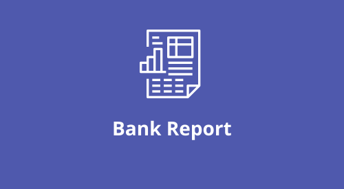

<div align="center">
	
</div>

## Sumário

-   [Objetivo](#objetivo)
-   [Pré Requisitos](#pre-requisitos)
-   [Tecnologias que estão sendo utilizadas no projeto](#tecnologias)
-   [Padrão de código](#padrao-de-codigo)
-   [IDE utilizada para a codificação](#ide)
-   [Plugins para instalar no Visual Studio Code (Vscode)](#plugins)
-   [Instalação do projeto](#instalacao)

## <h2 id="objetivo">:dart: Objetivo</h2>

O Bank Report é uma aplicação que disponibiliza uma base de dados focadas em análise de informações com um grande volume de dados.

## <h2 id="pre-requisitos">:books: Pré Requisitos</h2>

-   [Node](https://nodejs.org/en/)
-   [Yarn](https://yarnpkg.com/)
-   [Git](https://git-scm.com/)
-   [Editor de código - Vscode](https://code.visualstudio.com/)

## <h2 id="tecnologias">:hammer_and_wrench: Tecnologias que estão sendo utilizadas no projeto</h2>

-   [React](https://pt-br.reactjs.org/)
-   [Redux](https://redux.js.org/)
-   [Hooks](https://pt-br.reactjs.org/docs/hooks-intro.html)
-   [Function Components](https://pt-br.reactjs.org/docs/components-and-props.html)
-   [React Virtualized](https://bvaughn.github.io/react-virtualized/#/components/List)

## <h2 id="padrao-de-codigo">:desktop_computer: Padrão de código</h2>

-   [Eslint](https://eslint.org/docs/user-guide/formatters/)
-   [Prettier](https://prettier.io/)
-   [EditorConfig](https://editorconfig.org/)
-   [Commitlint](https://commitlint.js.org/#/)

## <h2 id="ide">:headphones: IDE utilizada para a codificação</h2>

-   [Visual Studio Code](https://code.visualstudio.com/)

## <h2 id="plugins">:electric_plug: Plugins para instalar no Visual Studio Code (Vscode)</h2>

-   [EditorConfig for VS Code](https://marketplace.visualstudio.com/items?itemName=EditorConfig.EditorConfig) - Mantém a configuração do projeto igual em todas a ide's do vscode
-   [EsLint](https://marketplace.visualstudio.com/items?itemName=dbaeumer.vscode-eslint) - É responsável por verificar a sintaxe e análise de código, provendo sugestões de solução
-   [Prettier](https://marketplace.visualstudio.com/items?itemName=esbenp.prettier-vscode) - É responsável por formatar o código de uma maneira padronizada de acordo com as configurações já definidas

## <h2 id="instalacao">:wrench: Instalação do projeto</h2>

Abra seu terminal e faça o clone do projeto em um diretório da sua máquina, para isso rode:

```bash
git clone https://github.com/ReneSena/app-report-with-redux.git ou git@github.com:ReneSena/app-report-with-redux.git
```

Após o download do projeto ser finalizado, a pasta front-saas-backoffice estará disponível no diretório que foi realizado o download.

## :rocket: Como executar o projeto?

Existem duas formas de abrir o projeto, uma delas é abrindo o vscode indo na opção File -> Open Folder e escolher a pasta do projeto que deseja abrir. A outra opção é navegar através do terminal até pasta que deseja abrir e rodar o comando:

```
code .
```

Isso fará com que o vscode seja aberto na pasta selecionada.

#### :one: Instalando dependências do projeto

Depois de ter realizado o processo de clonagem, é necessário instalar as dependências do projeto, para isso, em seu terminal na pasta do projeto rode:

```bash
yarn install
```

Em seguida, na pasta do projeto, utilize o comando abaixo para visualizar o projeto em desenvolvimento:

```bash
yarn start
```

Irá abrir uma nova aba do navegador com o endereço: http://localhost:3000

## <h2 id="ambientes">:earth_americas: Ambientes</h2>

-   Desenvolvimento: http://localhost:3000/
-   Produção: http://app-youtube-flix-renesena.vercel.app/
